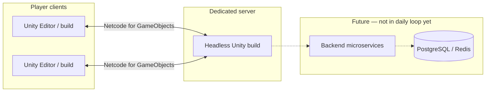
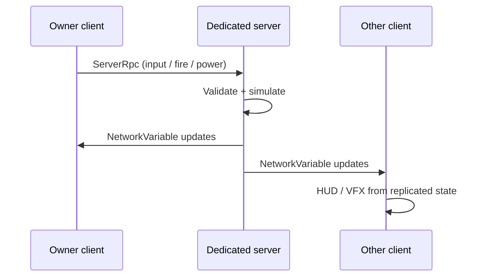

# Developer Onboarding — Iron Exiles (Malestrom)

A short guide for new game developers joining the project. It explains **what the repo is**, **how the pieces fit together**, and **how to run and extend the game today**.

---

## What you are building

**Iron Exiles** is a multiplayer space combat MMO (inspired by *Earth & Beyond*). Players fly ships in sectors, fight with weapons, manage power, and (eventually) progress through trade, exploration, and social systems.

This repo is the **game prototype**: a Unity client plus a headless dedicated server. Backend services (auth, accounts, economy) are planned but not the focus of day-to-day gameplay work yet.

**Engine:** Unity 6 LTS (C#). Unreal code under `legacy/unreal/` is old reference only — do not extend it.

---

## Big picture



**Today:** two Unity clients can connect to one dedicated server in a test sector (`EmptySector`), see each other’s ships, move, target, allocate power, and fire beams.

**Tomorrow:** persistence, missions, economy, and galaxy travel layer on top of the same client + server split.

---

## Repository layout

| Path | What it is |
|------|------------|
| `Client/` | **Main Unity project** — open this in Unity Hub |
| `Client/Assets/_Project/` | All game code, tests, and project-specific assets |
| `Client/Assets/Scenes/Test/EmptySector.unity` | Primary test scene (single-player or multiplayer) |
| `docs/` | Game design (`01-races.md`, `04-space-combat.md`, …) and how-to guides |
| `Scripts/` | PowerShell helpers (open editor, run tests, build server) — **not** Unity gameplay code |
| `.adlc/` | Spec-driven development: requirements, architecture, tasks per feature (REQ-xxx) |
| `legacy/unreal/` | Deprecated UE5 scaffold |
| `deploy/` | Placeholder for backend / K8s (future) |

**Rule of thumb:** gameplay changes live under `Client/Assets/_Project/`. Repo-root `Scripts/` is automation only.

---

## Unity code structure (assemblies)

Code is split into **assembly definitions** so dependencies stay clear:

```
IronExiles.Core          → tiny bootstrap / shared types
IronExiles.Combat        → flight, weapons, targeting, cameras, telemetry interfaces
IronExiles.Networking    → Netcode session, spawners, prefab factories (depends on Combat)
IronExiles.UI            → HUD views and presenters (depends on Combat, not the other way around)
IronExiles.Core.Tests    → Edit Mode unit tests
```

**Important:** `Combat` must **not** reference `UI`. The HUD binds to ships through interfaces like `IShipFlightTelemetry` and bootstrap components in the UI assembly (see LESSON-005 in `.adlc/knowledge/lessons/`).

Typical namespaces:

- `IronExiles.Combat` — ship movement, weapons, power
- `IronExiles.Networking` — connection, spawn, multiplayer bootstrap
- `IronExiles.UI` — flight HUD

---

## How a play session works

### Single-player (offline)

1. Open `Client/` in Unity, load **EmptySector**.
2. Press **Play** with auto-connect **off** (default in editor).
3. `EmptySectorFlightSetup` spawns a local ship with movement, camera, and HUD.
4. You fly in the sector with no network stack.

### Multiplayer (local dev)

1. Start the dedicated server: `.\Scripts\Launch-LocalMultiplayerDev.ps1` (or run server + editor separately).
2. Unity loads **EmptySector** with `EmptySectorMultiplayerBootstrap`, which wires **Netcode for GameObjects** + **Unity Transport**.
3. Server spawns player ships via `PlayerShipSpawner` / `NetworkPlayerShipFactory`.
4. Each **owner client** sends input; **server** simulates movement, targeting, power, and damage; state **replicates** to other clients.



---

## Gameplay systems (what exists today)

Features are delivered in **tiers** (see `.adlc/specs/REQ-031-delivery-roadmap/`). Current prototype stack:

| System | Purpose | Key types |
|--------|---------|-----------|
| **Flight** | 6DOF Newtonian movement | `ShipMovementModel`, `ShipMovementController`, `ShipInputController` |
| **Replication** | Server-authoritative movement + client prediction | `NetworkShipMovementController` |
| **HUD & camera** | Cockpit view + flight bars | `FlightHudView`, `FlightHudPresenter`, `CockpitCameraRig` |
| **Networking shell** | Connect, spawn, session | `NetworkSessionManager`, `EmptySectorMultiplayerBootstrap` |
| **Targeting** | Tab-lock + radar | `NetworkShipTargetingController`, `TargetSelectionMath` |
| **Power** | W/S/E/ECM allocation | `NetworkShipReactorPowerController`, `ReactorPowerAllocationMath` |
| **Weapons** | Beam + hull damage (stub) | `NetworkShipBeamWeaponController`, `NetworkDamageableHealth` |

**Design intent:** the **server decides** combat outcomes (damage, locks, movement authority). Clients show UI and VFX from replicated state — they do not apply damage locally.

---

## Where code lives on a ship

Player ships are built in code at runtime (`NetworkPlayerShipFactory`), not only from scene prefabs. A networked ship roughly has:

- `NetworkObject` + `NetworkTransform`
- Movement: `ShipMovementController`, `NetworkShipMovementController`, `ShipInputController`
- Combat: targeting, reactor power, beam weapon, damageable health
- Setup: `NetworkedShipSetup` (owner vs remote: camera, HUD adapter, affiliation)
- Input: `ShipTargetInputController` (Tab), `ShipBeamWeaponInputController` (fire)

Training dummies are spawned server-side by `TargetDummySpawner`.

---

## Controls (current prototype)

| Input | Action |
|-------|--------|
| W / S / A / D / Space / Ctrl | Thrust / strafe |
| Mouse | Pitch / yaw |
| Q / E | Roll |
| Tab | Cycle lock target |
| Left mouse (hold) | Fire beam on locked target |
| HUD sliders / presets | Power allocation (weapons, shields, engines, ECM) |

Full multiplayer steps: `docs/local-multiplayer-test.md`. Beam combat: `docs/beam-weapon-damage.md`.

---

## Day-one setup

### Prerequisites

- Unity Hub + **Unity 6 LTS** (version in `Client/ProjectSettings/ProjectVersion.txt`)
- .NET SDK as required by that Unity version
- (Optional) PowerShell for repo scripts

### Run the game

```powershell
# Open Unity on Client/
.\Scripts\Launch-UnityEditor.ps1

# Or: server + Unity in one step for multiplayer dev
.\Scripts\Launch-LocalMultiplayerDev.ps1
```

In Unity: open `Assets/Scenes/Test/EmptySector.unity` → **Play**.

### Run tests

Close the Unity Editor first, then:

```powershell
.\Scripts\Run-UnityTests.ps1
```

Tests live in `Client/Assets/_Project/Tests/EditMode/` (pure math, movement, HUD presenter, etc.).

---

## How we develop features

Work is tracked as **REQ-xxx** specs under `.adlc/specs/REQ-xxx-*/`:

- `requirement.md` — what and why
- `architecture.md` — design decisions
- `tasks/` — implementable chunks

Branches often look like `feat/REQ-039-beam-weapon-damage`. Each REQ should stay **runnable** and **testable** before the next tier starts.

When you pick up work:

1. Read the REQ spec and architecture for that feature.
2. Skim related code in `IronExiles.Combat` / `IronExiles.Networking`.
3. Add or extend **Edit Mode tests** for pure logic.
4. Verify in **EmptySector** (offline and/or local multiplayer).

---

## Conventions (quick reference)

| Topic | Convention |
|-------|------------|
| C# types | `PascalCase`; private fields `_camelCase`; interfaces `I` prefix |
| ScriptableObjects | Suffix `Definition`, `Config`, or `Data` |
| Server authority | Damage, locks, movement sim on server; clients request via `ServerRpc` |
| UI data | Combat exposes telemetry interfaces; UI assembly binds in bootstrap |
| Commits | Imperative message; mention REQ when relevant |

Full detail: `.adlc/context/conventions.md`.

---

## What to read next

| If you want to… | Start here |
|-----------------|------------|
| Understand the MMO vision | `docs/05-architecture.md`, `docs/04-space-combat.md` |
| Run two clients locally | `docs/local-multiplayer-test.md` |
| See flight / HUD details | `Client/README.md` |
| See technical ADRs | `.adlc/context/architecture.md` |
| See what shipped and what’s next | `.adlc/specs/REQ-031-delivery-roadmap/` or run ADLC `/status` |
| Avoid past mistakes | `.adlc/knowledge/lessons/` |

---

## Common gotchas

1. **Open the `Client/` folder in Unity**, not the repo root.
2. **Close Unity** before batchmode tests (`Run-UnityTests.ps1`).
3. **Do not reference UI from Combat** — use telemetry interfaces and UI-side bootstrap.
4. **Multiplayer needs the server running** before clients connect (unless testing offline flight).
5. **Ignore `legacy/unreal/`** for new gameplay work.

Welcome aboard — fly something in EmptySector first, then trace one input (e.g. Tab lock) from client → server → replication → HUD. That path repeats for most combat features.
